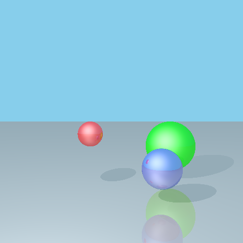
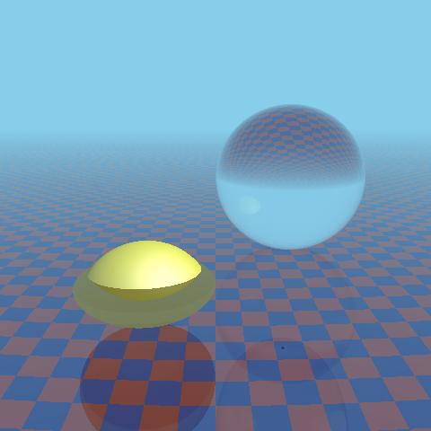

# Ray Tracer Project!
Reed College, CSCI221 Fall Final Project

<!----->
<p float="left">
    
    
    
</p>

## Table of Contents
- [Overview](#overview)
- [Requirements](#requirements)
- [Installation](#installation)
- [Installing Missing Requirements](#installing-missing-requirements)
    - [Mac](#mac)
    - [Linux](#linux)
- [Usage](#usage)
    - [Scene Structure](#scene-structure)
    - [Running the Ray Tracer](#running-the-ray-tracer)
    - [Example Scenes](#example-scenes)
    - [Advanced Scene Structure](#advanced-scene-structure)
    - [Testing and Cleaning](#testing-and-cleaning)
-  [Contributors](#contributors)

## Overview
### What is a Ray Tracer?
<!---idk man but I think it will look nice to have this here-->
Essentially, we have created a renderer, by using ray tracing. Physics is cool and we can use it to figure out how light would bounce off different objects to figure out how much light each pixel should have.

<!---### What about this project in particular
specifics about this project, may delete later if not much to say -->

## Requirements
1. A Unix or Linux based terminal (Mac terminal, Linux terminal, WSL2 on windows, etc)
2. `g++` compiler (with version support for C++17 or later) installed on your terminal/command line interface
3. `git` installed on your terminal/command line interface

## Installation 
> [!WARNING]
> Make sure you have both `git` and a working `g++` compiler installed before proceeding. See [here](#installation-requirements) for instructions.

Download using `git clone`:
```
git clone https://github.com/michaeldunnpro/cppraytracer
```
or otherwise download this repository.

## Installing Missing Requirements 
All installation is done though terminal/command line interface.
### Mac
<!---If you don't already, install command tools: 
```
xcode-select --install
```-->
First install `brew` as a package manager:
``` 
/bin/bash -c "$(curl -fsSL https://raw.githubusercontent.com/Homebrew/install/HEAD/install.sh)"
```
taken from the [homebrew website](https://brew.sh/), follow the instructions as prompted by the terminal.

Install `git`:
```
brew install git
```
Install `g++` compiler:
```
brew install gcc
```

### Linux

*Ubuntu/Debian*:

Install `git`:
``` 
sudo apt-get install git 
```
Install `g++` compiler:
``` 
sudo apt-get install g++ 
```

*Fedora*:

Install `git`:
``` 
sudo dnf install git 
```
Install `g++` compiler:
``` 
sudo dnf install g++ 
```

_Arch:_

Install `git`:
``` 
sudo pacman -s git 
```
Install `g++` compiler:
``` 
sudo pacman -s gcc
```

## Usage
Scenes are located in the `scenes/` directory. You can create your own scene by making a new `.cpp` file in that directory and following the structure of `example_scene.cpp`.

### Scene Structure
All scenes should be created in the `scenes/` directory as a .cpp file.
1. Begin file with:
```cpp
#include "../src/scene_constructor.hpp"
```
which includes all necessary headers and convenience functions.
Next, in the main function, follow these steps:

2. Create camera, screen, and scene objects:
```cpp
auto camera = cam(Point(x, y, z), Vector(dx, dy, dz));
auto scr = screen(width, height);
auto scn = scene(camera, scr, ambient_light, specular_light, highlight_size, background_color);
```
The convenience function `camera` takes in a position and a direction vector, which can be excluded to default 
to a standard view. The convenience function `screen` takes in width and height parameters (default `10.0`).
The convenience function `scene` takes in the camera and screen objects. Optionally, you can specify ambient light intensity (default `0.2`), specular light intensity (default `0.5`), highlight size (default `8.0`), and background color (default `rgb(135, 206, 235)`).

3. Define materials for objects:
```cpp
auto material_name = material(rgb(r, g, b), reflectivity);
```

The convenience function `material` takes in a color and an optional reflectivity value (`0.0` to `1.0`, default `0.5`).

4. Add objects to the scene using the convenience functions:
`sphere(center, radius, material, scene)`, `plane(point, normal, material, scene)`.
<!---, and `triangle(v1, v2, v3, material, scene)`-->

5. Add point lights to the scene:
```cpp
scn.add_light<BasicPointLight>(Point(x, y, z));
```
The member function `Scene::add_light<BasicPointLight>()` also accepts
an optional parameter specifying the color of light.

6. Finally, call `handle_input(scn)` to render the scene and handle user input for camera adjustment.

An example of the most basic scene structure is as follows:
```cpp
#include "../src/scene_constructor.hpp"
int main() {
    auto camera = cam();
    auto scr = screen();
    auto scn = scene(camera, scr);

    auto red_mat = mat(rgb(255, 0, 0));
    auto gray_mat = mat(rgb(200, 200, 200), 0.2f);

    sphere(Point(0.0f, 0.0f, 0.5f), 0.5f, red_mat, scn);
    plane(Point(0.0f, 0.0f, -0.1f), Vector(0.0f, 0.0f, 1.0f), gray_mat, scn);

    scn.add_light<BasicPointLight>(Point(0.0, -0.5, 1.0));

    handle_input(scn);
    return 0;
}
```
The included `example_scene.cpp` file contains a more complex example scene, 
which you can use as a reference when creating your own scenes.

### Running the Ray Tracer
The ray tracer is run from the terminal using a make command for a given scene.
In the project's root, run the following command to compile and run a scene:
```
make scene SCENE=scenes/your_scene.cpp
```
Replace `your_scene.cpp` with the name of your scene file.
By default, `make scene` will compile and run `example_scene.cpp`,
which will allow you to move around the scene in a command line viewer. Once 
you're happy with the view, press `q` to quit and render the image.
The image is output as `image.ppm` in the project's root directory.

By default, `make scene` compiles with optimization in order to maximize performance. To instead compile with debug information, use `make debug` instead:
```
make debug SCENE=scenes/your_scene.cpp
```

### Example Scenes
Several example scenes are available to illustrate different features of the ray tracer.

- `example_scene.cpp` creates a basic scene with three spheres and a plane.
- `example_scene2.cpp` creates another basic scene, with multiple/colored lights.
- `pattern.cpp` creates a plane with reflectivity patterns.
- `transparent.cpp` uses a transparent material with pure reflection and refraction.
- `pbr.cpp` uses an alternative material, based on Cook-Torrance model with importance sampling for specular reflections (hence expect the render process to be slower).
- `soccerball.cpp` combines multiple features to render a soccer ball on a green ground. A custom subclass of `Sphere` is created to compute the color pattern on the soccer ball, which is placed on a green plane colored with Perlin noise. Alternative material is used for both objects.

### Advanced Scene Structure

#### Coordinates
`Point`s and `Vector`s are specified by coordinates. It is helpful to think
the $x$-axis as pointing to the right, $y$-axis forward, and $z$-axis upward.

#### Color
`Color`s are specified by sRGB value from `0` to `255`. Internally, they are
converted to an approximately linear color space. If one wants to specify a
raw value, for example as a color filter, they should use `Color::raw(r, g, b)`,
where `r`, `g`, and `b` typically range from `0` to `1`.

#### Material
Materials describe the shading behavior at a single point. An instance of
`Shape` is able to specify a (possibly different) `Material` at each point
on the shape. As `Material`s are mostly passed to constructors of `Shape`,
they can be initialized directly. Existing implementations of `Material` are
`BasicMaterial`, `TransparentMaterial`, and `PBRMaterial`. The
convenient function `mat()` is a wrapper around `BasicMaterial`.

#### Shape
The general way to add a shape is `Scene::add_shape<T>()`, where `T` is
a subclass of `Shape`. The parameters are passed to the constructor of `T`.
Existing implementations of `Shape` are `BasicPlane`, `BasicSphere`, and
`ParametricPlane`. The convenience functions `plane()` and `sphere()` are
wrappers around `BasicPlane` and `BasicSphere`, respectively.

There are intermediate subclasses of `Shape` that specifies the geometry
of the shape but not the material at each point. They can be inherited by
multiple concrete classes that may or may not perform additional calculations
to compute the `Material` at each point. Existing intermediate subclasses
are `Plane` and `Sphere`.

#### Light
The general way to add a light is `Scene::add_light<T>()`, where `T` is
a subclass of `Light`. The parameters are passed to the constructor of `T`.
Existing implementations of `Light` are `BasicPointLight` and
`InverseSquarePointLight`.

### Testing and Cleaning
Here are the commands that you can run from the project's makefile,
located in the project root directory.

Compiling the test code: 
```
make test
```

Running the test code:
```
make run
```

Checking for leaks (Mac only):
```
make leaks
```

Checking for leaks (Linux only):
```
make val-leaks
```

Cleaning away old executables:
```
make clean
```

## Contributors
Frank Y, Micheal B, Michael D, Xanthe N
