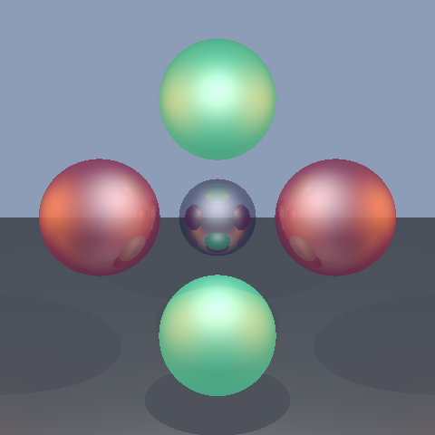

# Ray Tracer Project!
Reed College, CSI221 fall Final Project

<!----->
<p align="center">
    
</p>

## Table of Contents
- [Overview](#overview)
- [Requirements](#requirements)
- [Installation](#installation)
- [Installing Requirements](<#Installing Requirements>)
    - [Mac](#Mac)
    - [Linux](#linux)
- [Usage](#Usage)
    - [Interfacing with the ray tracer](<#Interfacing with the ray tracer>)
    - [Compiling, Testing and cleaning](<#Compiling, Testing and cleaning>)
    - [Scene Structure](<#Scene Structure>)
-  [Contributors](#Contributors)

## Overview
### What is a ray tracer?
idk man but I think it will look nice to have this here

 <!---### What about this project in particular
specifics about this project, may delete later if not much to say -->

## Requirements
1. A unix or linux based terminal (Mac terminal, linux terminal, WSL2 on windows, etc)
2. g++ compiler (with version support for C++17 or later) installed on your terminal/command line interface
3. git installed on your terminal/command line interface


## Installation 
> [!WARNING]
> Make sure you have both git and a working g++ compiler installed before proceeding. See [here](<#Installation Requirements>) for instructions.

Install using git clone
```
git clone https://github.com/michaeldunnpro/cppraytracer
```

## Installation Requirements 
All installation is done though terminal/command line interface.
### Mac
<!---If you don't already, install command tools: 
```
xcode-select --install
```-->
First install brew as a package manager:
``` 
/bin/bash -c "$(curl -fsSL https://raw.githubusercontent.com/Homebrew/install/HEAD/install.sh)"
```
taken from the [homebrew website](https://brew.sh/), follow the instructions as prompted by the terminal.

git
```
brew install git
```
g++ compiler
```
brew install gcc
```

### linux

*Ubuntu/Debian*:

git
``` 
sudo apt-get install git 
```
g++ compiler
``` 
sudo apt-get install g++ 
```

*Fedora*:

git
``` 
sudo dnf install git 
```
g++ compiler
``` 
sudo dnf install g++ 
```

_Arch:_

git
``` 
sudo pacman -s git 
```
g++ compiler
``` 
sudo pacman -s gcc
```


## Usage
Scenes are located in the scenes/directory. You can create your own scene by making a new .cpp file in that directory and following the structure of example_scene.cpp.

### Scene Structure
All scenes should be created in the ```scenes/``` directory as a .cpp file.
1. Begin file with:
```cpp
#include "../src/scene_constructor.hpp"
```
which includes all necessary headers and convenience functions.
Next, in the main function, follow these steps:

2. Create camera, screen, and scene objects:
```cpp
auto camera = cam(Point(x, y, z), Vector(dx, dy, dz));
auto scr = screen(width, height);
auto scn = scene(camera, scr, ambient_light, specular_light, highlight_size, background_color);
```
The convenience function ```camera``` takes in a position and a direction vector, which can be excluded to default 
to a standard view. The convenience function ```screen``` takes in width and height parameters (default 10.0).
 The convenience function ```scene``` takes in the camera and screen objects. Optionally, you can specify ambient light intensity (default 0.2), specular light intensity (default 0.5), highlight size (default 8.0), and background color (default Color(135, 206, 235)).

3. Define materials for objects:
```cpp
auto material_name = material(Color(r, g, b), reflectivity);
```

The convenience function ```material``` takes in a color and an optional reflectivity value (0.0 to 1.0, default 0.5).

4. Add objects to the scene using the convenience functions:
```sphere(center, radius, material, scene)```, ```plane(point, normal, material, scene)```, and ```triangle(v1, v2, v3, material, scene)```.

5. Add point lights to the scene:
```cpp
scn.add_point_light(Point(x, y, z));
```

6. Finally, call ```handle_input(scn);``` to render the scene and handle user input.

An example of the most basic scene structure is as follows:
```cpp
#include "../src/scene_constructor.hpp"
int main() {
    auto camera = cam();
    auto scr = screen();
    auto scn = scene(camera, scr);

    auto red_mat = mat(Color(255, 0, 0));
    auto gray_mat = mat(Color(200, 200, 200), 0.2f);

    sphere(Point(0.0f, 0.0f, 0.5f), 0.5f, red_mat, scn);
    plane(Point(0.0f, 0.0f, -0.1f), Vector(0.0f, 0.0f, 1.0f), gray_mat, scn);

    scn.add_point_light(Point(0.0, -0.5, 1.0));

    handle_input(scn);
    return 0;
}
```
The included example_scene.cpp file contains a more complex example scene, 
which you can use as a reference when creating your own scenes.


### Compiling, Testing and cleaning
Here are the commands that you can run from the projects makefile,
located in the project root directory.

Compiling the test code: 
```
make test
```

Running the test code:
```
make run
```

Checking for leaks (mac only):
```
make leaks
```

Checking for leaks (linux only):
```
make val-leaks
```

Cleaning away old executables:
```
make clean
```

### Interfacing with the ray tracer
The ray tracer is run from the terminal using a make command for a given scene.
In the project's root, run the following command to compile and run a scene:
```
make scene SCENE=scenes/your_scene.cpp
```
Replace ```your_scene.cpp``` with the name of your scene file.
By default, ```make scene``` will compile and run ```example_scene.cpp```,
which will allow you to move around the scene in a command line viewer. Once 
you're happy with the view, press 'q' to quit and render the image.
The image is output as ```image.ppm``` in the project's root directory.


## Contributors
Frank Y, Micheal B, Michael D, Xanthe N


